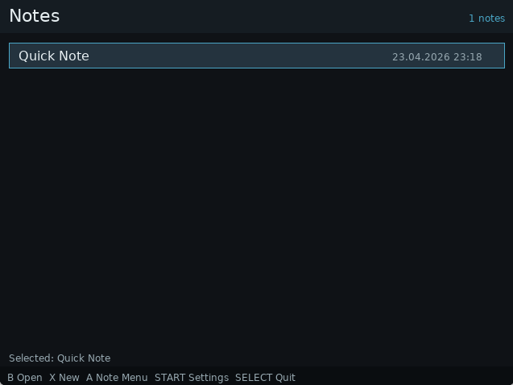
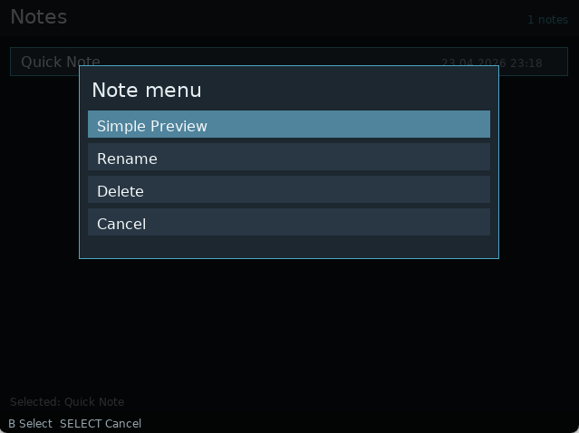
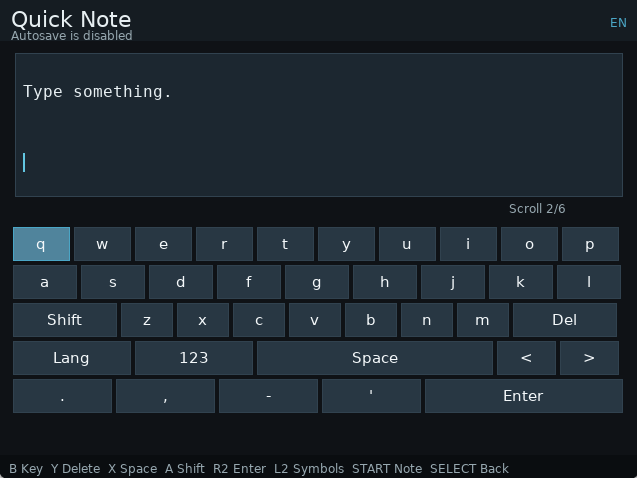
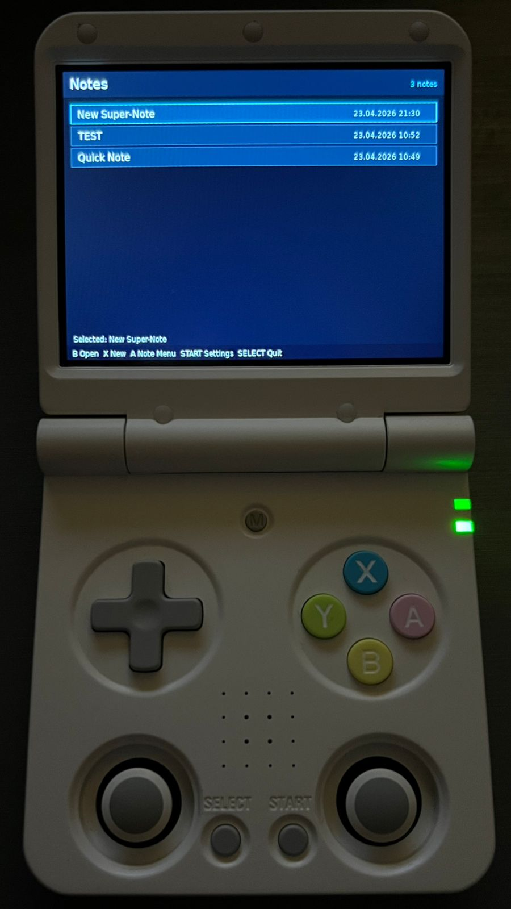
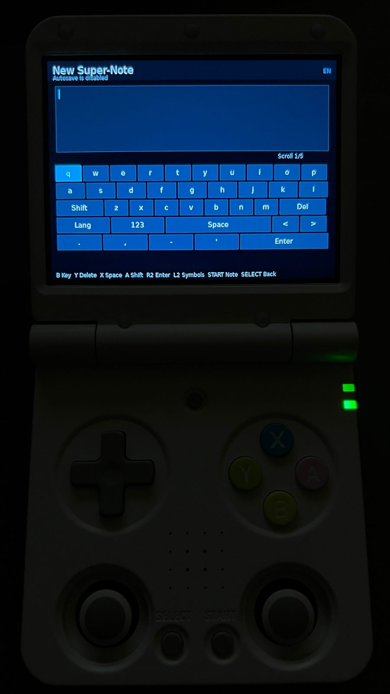

# Notes for Miyoo Flip V2

`Notes` is a note-taking app for Miyoo Flip V2 on Surwish OS.

## What it does

- create, open, rename, and delete notes
- edit notes with a virtual keyboard
- switch between multiple keyboard layouts, including Kazakh
- save manually or with optional autosave
- preview notes with a simple markdown view
- change editor text size

## Screenshots

| Note list | Note menu | Editor |
| --- | --- | --- |
|  |  |  |

### On device

| List view on device | Editor on device |
| --- | --- |
|  |  |

## Target

- device: Miyoo Flip V2
- system: Surwish OS
- input mapping: `notes.gptk`

This is a device-specific project. It is not intended to be a general desktop notes app.

## Install

Recommended Windows install:

```powershell
powershell -ExecutionPolicy Bypass -File .\tools\install_to_sd.ps1 -Drive X:
```

Replace `X:` with the drive letter of the Surwish OS SD card.

GitHub release install:

1. Download the release zip.
2. Extract it.
3. Open PowerShell in the extracted `Notes` folder and run:

```powershell
powershell -ExecutionPolicy Bypass -File .\tools\install_to_sd.ps1 -Drive X:
```

Manual runtime install:

1. Create `X:\App\Notes`.
2. Copy only the runtime files listed below from the repository root or from the extracted `Notes` release folder into `X:\App\Notes`.
3. Do not copy repository-only content such as `.github`, `tests`, `tools`, or `assets` to the device.
4. Copy `X:\App\PixelReader\gptokeyb` or `X:\App\RTC\gptokeyb` to `X:\App\Notes\gptokeyb`.
5. Copy `X:\App\PortMaster\PortMaster\gamecontrollerdb.txt` to `X:\App\Notes\gamecontrollerdb.txt`.
6. Create `X:\Data\Notes` if it does not already exist.
7. Safely eject the SD card and reboot the device.

Required files:

- `config.json`
- `icon.png`
- `iconsel.png`
- `launch.sh`
- `notes.gptk`
- `notes_app.py`
- `notes/`
- `gptokeyb`
- `gamecontrollerdb.txt`

Device path after install:

- `/mnt/SDCARD/App/Notes`

## Runtime data

Default runtime data paths:

- notes: `/mnt/SDCARD/Data/Notes`
- config: `/mnt/SDCARD/Data/Notes/settings.json`
- app log: `/mnt/SDCARD/Data/Notes/notes.log`
- crash log: `/mnt/SDCARD/Data/Notes/notes-crash.log`
- launch log: `/mnt/SDCARD/Data/Notes/notes-launch.log`

## Troubleshooting

If the app returns to the Apps menu, check:

- `X:\Data\Notes\notes-launch.log`
- `X:\Data\Notes\notes-crash.log`

If controls type letters instead of moving, reinstall with `tools\install_to_sd.ps1` so `gptokeyb` and `gamecontrollerdb.txt` are copied correctly.

## Local development

For local development you can override runtime paths with environment variables:

- `MIYOO_SDCARD_ROOT`
- `NOTES_DIR`
- `NOTES_SDL_EXLIBS`
- `NOTES_SDL_DLL_PATH`
- `NOTES_FONT_UI`
- `NOTES_FONT_MONO`

Typical local checks:

```bash
python -B -m unittest discover -s tests -t .
python - <<'PY'
import pathlib, py_compile
for path in pathlib.Path('.').rglob('*.py'):
    py_compile.compile(str(path), doraise=True)
print('py_compile ok')
PY
```

Running the app locally requires SDL2 and PySDL2 to be available either in the environment or through the override paths above.

## Desktop screenshots on PC

You can run the app on a PC in windowed mode and take screenshots there.

What you need on Windows:

- Python
- `PySDL2`
- `pysdl2-dll`

Important:

- the SDL libraries on the Surwish OS SD card are Linux libraries, so they are not enough for Windows
- the simplest setup is to install `PySDL2` and `pysdl2-dll` in your local Python environment
- fonts can still be reused from the SD card if you want

Recommended Windows setup:

```powershell
py -m pip install PySDL2 pysdl2-dll
py -c "import sdl2; print('PySDL2 ok')"
```

Windowed desktop run with fonts from the SD card:

```powershell
powershell -ExecutionPolicy Bypass -File .\tools\run_desktop.ps1 `
  -Python py `
  -WindowScale 3 `
  -FontUi "F:\System\resources\DejaVuSans.ttf" `
  -FontMono "F:\App\PixelReader\resources\fonts\DejaVuSansMono.ttf"
```

If the SD card is not mounted, point `-FontUi` and `-FontMono` to any local `.ttf` fonts instead.

This starts the app in a normal desktop window instead of fullscreen. After that you can use regular Windows tools for screenshots or recording.

## Repository layout

- `notes/`: application code
- `tests/`: unit tests
- `notes_app.py`: Python entry point
- `launch.sh`: device launcher
- `notes.gptk`: input mapping for the device
- `tools/install_to_sd.ps1`: SD card installer
- `tools/run_desktop.ps1`: windowed desktop launcher for local screenshots and preview
- `tools/build_release.ps1`: builds a clean release folder and zip in `dist/`

## Build release package

From the repository root:

```powershell
powershell -ExecutionPolicy Bypass -File .\tools\build_release.ps1
```

This creates:

- `dist\Notes\`
- `dist\Notes-release.zip`

The release package does not include `gptokeyb` or `gamecontrollerdb.txt`. The installer copies them from the target SD card.

## Controls

See [INPUT_MAPPING.md](INPUT_MAPPING.md).

## Docs

- [ARCHITECTURE.md](ARCHITECTURE.md)
- [KNOWN_LIMITATIONS.md](KNOWN_LIMITATIONS.md)
- [INPUT_MAPPING.md](INPUT_MAPPING.md)

## Author

- Adilkhan Shaikhy
- GitHub: [SheikhAdd](https://github.com/SheikhAdd)

## License

MIT. See [LICENSE](LICENSE).
